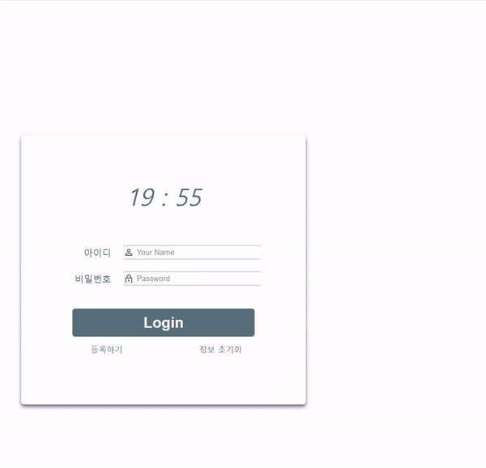

# Javascript Project [Daily Planner]  
<Br>

### Prject Title: [DailyPlanner](https://dailyplanwithchecklist.netlify.app)  
### Prject Term: 2022. 02. 21 ~ 2022. 03. 23  
### Project Reference: [NomadeCodes](https://nomadcoders.co/javascript-for-beginners/lobby)  
### Stack/skill : html5, css3, javascript  
<br>  

---
<br>

## 1. UI viewport (with Mobile)  
<br>  

  
__주요 코드는 html과 css파일을 확인해주세요.__

<br>  

---  
<br>

## 2. Javascript Main Code Review
<br>  

### 1. Clock module

  ```javascript
    function clock() {
      const date = new Date(); // use Date() with new object
      const hours = date.getHours() // many types in Date().. just one ex

      // The hours expressed in double digits even including 0 when under 10
      const hours = String(date.getHours()).padStart(2, "0");
    }
    clock()
    setInterval(clock(), terms of the time(1000 = 1s))
  ```
<br>  

### 1-1 . Date Module

  ``` javascript
    const today = new Date();

    let day = today.getDay();
    // From sunday to saturday, the number is from 0 to 6
    
    // In this project, used a switch-case function
    switch (day) {
      case 0:
        day = "SUN"
        break
        ...
      case 6:
        day = "SAT"
        break
    }
  ```
<br>

### 2. Weather module (just for review of the nomadcoder lecture)  
  [openweahtermap API](https://openweathermap.org/)

  ``` javascript
    navigator.geolocation.getCurrentPosition(geoSuccess, geoFailure);
    // getCurrentPosition (SuccessCallback, FailureCallback)
    
    function geoSuccess(position) {
      const lat = position.coords.latitude;
      const lng = position.coords.longitude;
      const weatherUrl = `https://api.openweathermap.org/data/2.5/weather?lat=${lat}&lon=${lng}&appid=${API_KEY}&units=metric`
      // Through openweathremap, after signing up for this site, can get api key for the API_KEY position.
      
      fetch(weatherUrl)
        .then(response => response.json())
        .then(data => {
          const climate = data.weather[0].main; // current location's climate
          const site = data.name // current location's name
          const temperature = data.main.temp.toFixed(1); // current location's temperature  

          // As Kelvin temperature is standard in this API, should subtract 273.15 to express Celsius temperature.
        });
    }

    function geoFailure() {
      alert("error!!");
    }
  ```
<br>

### 3. Login & Sign-Up Modal & TodoList "WEB API - LocalStorage"

  ```javascript
    let array = [] // basic array used for parsing the values of the localStoarge
    localStorage.setItme(key, value) // to save ket and value
    localStorage.getItme(key) // to load only the value
    localStorage.clear() // to delete all the keys and values
    localStorage.removeItem(key) // to delte only declared key
  ```  

  __JSON.stringify() and JSON.parse()__ is a main concept with WEB API

<br>

---
<br>


